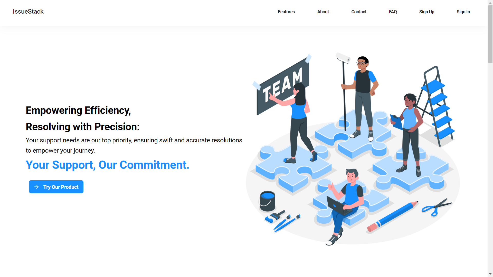
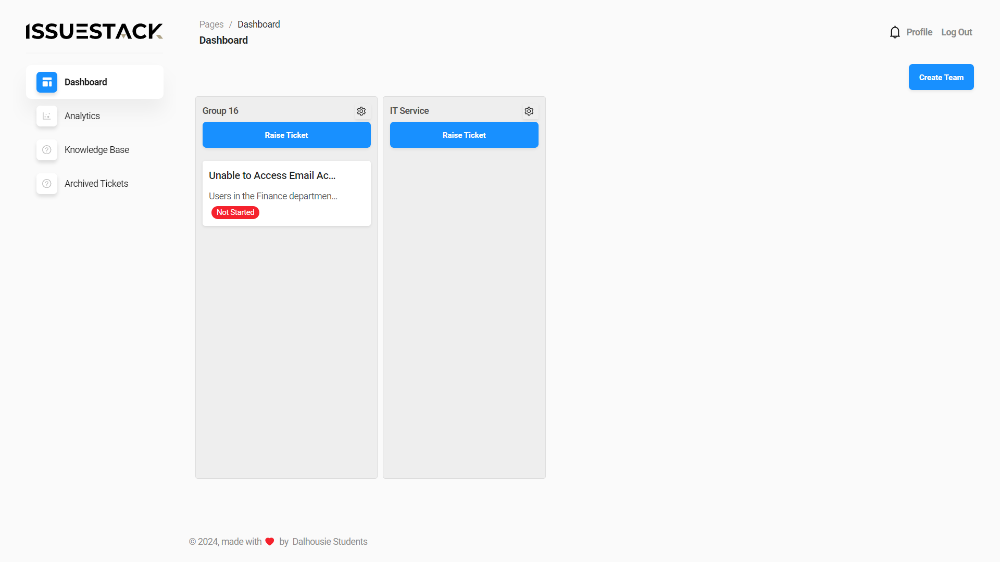
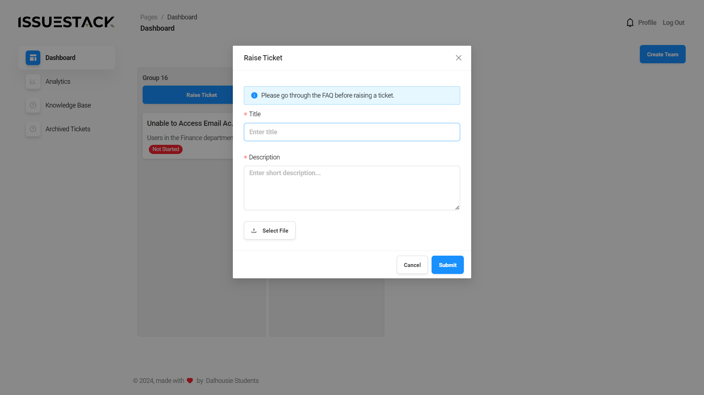
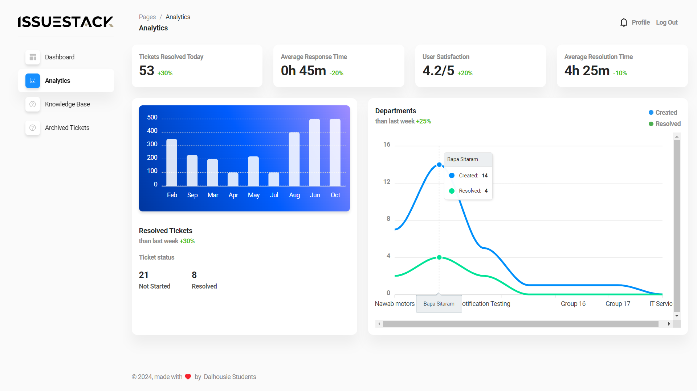

# IssueStack - Internal Support Ticket Tool

IssueStack is an internal support ticket system built with the MERN stack (React, Node.js, Express, MongoDB). It offers user authentication, profile management, issue board management, team assignment, ticketing with auto-assignment, and in-app notifications.

### Tech Stack

- **Frontend:** React.js (ES Modules, Async/Await, Destructuring, Hooks, Pub/Sub, Context API, Immutable Data Structures)
- **Backend:** Node.js & Express.js
- **Database:** MongoDB
- **Development Tools:** VS Code
- **Deployment:** Render
- **APIs:** RESTful APIs

### Features

- **User Management:** Secure login with email and profile management.
- **Issue Board:** Create, manage, and visualize your support tickets.
- **Team Collaboration:** Assign teams and individuals to tickets for efficient resolution.
- **Ticketing System:** Raise tickets, get them auto-assigned, and manage their lifecycle.
- **Communication:** Facilitate communication with in-app comments and email notifications.

### Screenshots

#### Landing Page

#### Ticket Dashboard

#### Create Team

#### Add Members to the Team

#### Raise Ticket

#### Ticket Details

#### Analytics

#### Knowledge Base

